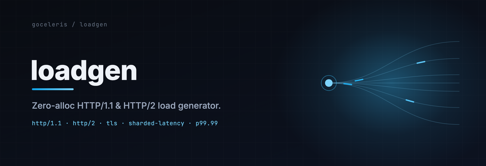

<p align="center">
  
</p>

# loadgen

[](https://pkg.go.dev/github.com/goceleris/loadgen)
[](https://github.com/goceleris/loadgen/actions/workflows/ci.yml)
[](LICENSE)

A measurement-grade HTTP/1.1 and HTTP/2 load generator for benchmarking web servers.

loadgen ships its own H1 and H2 clients rather than wrapping `net/http`, so the numbers it reports describe the server under test and not the client's overhead. Latency is recorded per worker in sharded HdrHistograms with no lock contention on the hot path, and percentiles come from a merged histogram spanning 1µs to 30s at three significant digits. It is the reference load generator for the [goceleris/probatorium](https://github.com/goceleris/probatorium) cluster benchmark.

Part of the goceleris family — [celeris](https://github.com/goceleris/celeris) (the server), [probatorium](https://github.com/goceleris/probatorium) (the harness), loadgen (this), and [docs](https://github.com/goceleris/docs). Full documentation lives at [goceleris.dev](https://goceleris.dev).

## Highlights

- **Custom H1/H2 clients.** Pre-formatted request bytes, pre-encoded HPACK headers, and allocation-free HPACK status extraction keep client-side overhead out of your measurements.
- **Sharded latency recording.** One HdrHistogram per worker, merged once at completion — no lock on the cumulative hot path.
- **Honest percentiles.** p50 through p99.99 from a merged HdrHistogram, plus the full distribution exported as a V2-compressed HdrHistogram for downstream re-aggregation.
- **Streaming drivers.** Built-in WebSocket and SSE modes measure echo round-trips, broadcast fan-out, and inter-event delivery — not just request/response.
- **Rated mode.** Closed-loop constant-rate scheduling with Gil Tene coordinated-omission correction: backlog surfaces as honest tail latency instead of vanishing.
- **Federation.** Drive load from two hosts and merge their histograms client-side, for when a single box can't saturate the target.
- **Self-instrumentation.** A 1Hz process-CPU sampler and a Linux recv-queue probe flag the runs where loadgen itself — not the server — was the bottleneck.
- **Cluster-ready CLI.** `cmd/loadgen` emits a single JSON `Result` on stdout and progress on stderr, built to be driven remotely over SSH or Ansible.

## Installation

Library:

```
go get github.com/goceleris/loadgen
```

CLI:

```
go install github.com/goceleris/loadgen/cmd/loadgen@latest
```

## Quick start

### HTTP/1.1

```go
package main

import (
    "context"
    "fmt"
    "time"

    "github.com/goceleris/loadgen"
)

func main() {
    cfg := loadgen.Config{
        URL:         "http://localhost:8080/",
        Duration:    15 * time.Second,
        Connections: 256,
        Workers:     256,
    }
    b, err := loadgen.New(cfg)
    if err != nil {
        panic(err)
    }
    result, err := b.Run(context.Background())
    if err != nil {
        panic(err)
    }
    fmt.Printf("%.0f req/s, p99=%v\n", result.RequestsPerSec, result.Latency.P99)
}
```

### HTTP/2

```go
cfg := loadgen.Config{
    URL:      "http://localhost:8080/",
    Duration: 15 * time.Second,
    HTTP2:    true,
    HTTP2Options: loadgen.HTTP2Options{
        Connections: 16,
        MaxStreams:  100,
    },
    Workers: 64,
}
b, err := loadgen.New(cfg)
// ...
```

### HTTPS with custom TLS

```go
cfg := loadgen.Config{
    URL:                "https://api.example.com/health",
    Duration:           30 * time.Second,
    Connections:        128,
    Workers:            128,
    InsecureSkipVerify: true, // self-signed certs only
}
```

For client certificates, a custom CA pool, or a pinned cipher list, set `Config.TLSConfig` to a `*tls.Config` instead of using `InsecureSkipVerify`.

### Constant-rate (rated) benchmark

```go
cfg := loadgen.Config{
    URL:      "http://localhost:8080/",
    Duration: 30 * time.Second,
    Workers:  64,
    Rate:     10000, // 10k req/s, coordinated-omission corrected
}
```

### Progress monitoring

```go
cfg := loadgen.Config{
    // ...
    OnProgress: func(elapsed time.Duration, snapshot loadgen.Result) {
        fmt.Printf("\r%s: %d req, %.0f req/s",
            elapsed.Round(time.Second),
            snapshot.Requests,
            snapshot.RequestsPerSec)
    },
}
```

## Load modes

loadgen selects one driver per run. HTTP protocol selection (`-h2` / `-h2c-upgrade` / `-mix`) and the streaming drivers (`-mode`) are mutually exclusive — a run is one or the other.

### HTTP protocols

| Mode | Flag | What it measures |
| --- | --- | --- |
| **HTTP/1.1** (default) | *(none)* | Baseline request/response throughput. One persistent TCP connection per worker, pre-formatted request bytes written in a single syscall. For `Connection: close` workloads (`-close`), each worker round-robins a pool of connections so reconnect latency stays off the critical path. |
| **HTTP/2** | `-h2` | Multiplexed throughput. Prior-knowledge h2c: workers share connections and dispatch streams lock-free, with pre-encoded HPACK headers and batched `WINDOW_UPDATE`. |
| **h2c upgrade** | `-h2c-upgrade` | The RFC 7540 §3.2 cleartext upgrade path. Each connection starts as HTTP/1.1 carrying `Connection: Upgrade, HTTP2-Settings` + `Upgrade: h2c`, reads `101 Switching Protocols`, then switches to HTTP/2 on the same socket. Exercises the handshake that `-h2` skips. Cleartext only — TLS servers negotiate H2 via ALPN. |
| **Protocol mix** | `-mix h1:h2:upgrade=N:N:N` | A realistic traffic blend. Each new connection is assigned a protocol by weighted random draw and stays on it for life. |

### Streaming drivers

Set `-mode` (or `Config.Mode`) to drive a non-HTTP protocol. One long-lived connection is held open per worker; each unit of work flows through the same worker / latency / timeseries pipeline as an HTTP request.

| Mode | What it measures |
| --- | --- |
| `ws-echo` | RFC 6455 WebSocket echo round-trip latency (small text frame). |
| `ws-large-echo` | Echo round-trip with a 64 KiB payload — exercises framing and buffering under large frames. |
| `ws-hub` | Broadcast fan-out latency: the worker only reads, blocking until the server broadcasts the next frame. No outbound write per unit. |
| `sse-fanout` | Server-Sent Events delivery. One `GET` stream per worker; each unit blocks until the next event arrives, so inter-event delivery time *is* the recorded latency. |

Streaming modes are mutually exclusive with `-h2`, `-h2c-upgrade`, and `-mix`.

## Rated mode (coordinated-omission correction)

By default loadgen runs open-loop: dispatch as fast as the server will accept, and report throughput at saturation.

Pass `-rate <req/s>` (or set `Config.Rate`) to switch to a closed-loop constant-rate scheduler that emits one request every `1/rate` seconds. Crucially, latency is measured from the request's *intended* dispatch time, not the moment it actually left — Gil Tene's coordinated-omission correction. When the server stalls, the backlog of intended-but-unsent requests accumulates and surfaces as honest tail latency, instead of being hidden by a client that simply slowed down to match. Rated runs set `rated_mode: true`, `target_rps`, and `mode: "rated"` in the result.

`-rate` (closed-loop, coordinated-omission corrected) and `-max-rps` (open-loop token-bucket cap) are independent rate controls; `-rate` is the right one for latency-SLO measurement.

## Federation

When one host can't generate enough load to saturate the target, run loadgen on two boxes and merge their measurements client-side.

- Start a **sidecar** on the second host: `loadgen -sidecar :9099`. It binds, waits for a coordinator, and takes its entire workload from the coordinator's start frame.
- Start the **coordinator** with `-peer <sidecar-host>:9099` plus the usual flags. It dials the sidecar, both sides run the identical workload against the target at an agreed start time, and at end-of-run the coordinator pulls the sidecar's V2-compressed HdrHistogram and merges it into its own.

The wire protocol is deliberately minimal: a `loadgen-fed-v1` magic handshake followed by length-prefixed JSON frames (`start` / `ack` / `result` / `err`) over one TCP connection, no retries. It is best-effort — if any step fails, the coordinator records `federation.merge_succeeded = false` and reports its local-only histogram. Merge outcomes appear in the `federation` block of the result.

## HdrHistogram export

Every result carries the full latency distribution, not just the summary percentiles:

- `Result.Histogram` is a V2-compressed HdrHistogram (base64 in JSON), covering 1µs–30s at three significant digits. Empty when no samples were recorded.
- `loadgen.DecodeHistogram([]byte)` and the recorder's `EncodeHistogram()` are exported so downstream tools (the probatorium cluster aggregator) can decode, re-merge across cells, and recompute percentiles without re-running the benchmark.

This is the same encoding federation uses on the wire, so a merged multi-host distribution round-trips losslessly.

## Self-instrumentation

Two probes flag the runs where loadgen — not the server — was the limiting factor:

- **CPU sampler** (`-cpu-monitor`, on by default). Samples the loadgen process's own CPU at 1Hz and reports the P95 as `cpu_pct_p95` (percentage of available cores). A high value means loadgen was compute-bound and the throughput number is a client ceiling, not a server ceiling.
- **Recv-queue probe** (`-recvq-probe`, on by default, Linux only). Reads per-socket receive-queue depths from `/proc/net/tcp`. If the median across loadgen's sockets stays above 64 KB for ≥10s it latches `recvq_high: true` — the client couldn't drain responses fast enough, so the observed tail latency is loadgen-side. A no-op on non-Linux platforms.

## CLI usage

```
loadgen [flags] -url <target>
```

### Flags

| Flag | Default | Meaning |
| --- | --- | --- |
| `-url string` | *(required)* | Target URL. Must include scheme (`http`/`https`) and host. |
| `-duration duration` | `15s` | Measured benchmark duration (excludes warmup). |
| `-warmup duration` | `2s` | Warmup phase before measurement. `0` to skip. |
| `-connections int` | `256` | Number of H1 connections. |
| `-workers int` | `0` | Concurrent workers. `0` → `connections` for H1, `NumCPU*4` for multiplexed modes. |
| `-method string` | `GET` | HTTP method. |
| `-H "Key: Value"` | — | Custom header, repeatable. |
| `-body-file string` | — | Read the request body from a file. |
| `-close` | `false` | Send `Connection: close` (H1 only). |
| `-h2` | `false` | HTTP/2 prior-knowledge (h2c / h2). |
| `-h2c-upgrade` | `false` | HTTP/2 via the RFC 7540 §3.2 h2c upgrade handshake. |
| `-mix string` | — | Per-connection protocol mix, e.g. `h1:h2:upgrade=4:4:1`. |
| `-h2-conns int` | `16` | H2 connections. |
| `-h2-streams int` | `100` | Max concurrent H2 streams per connection. |
| `-mode string` | — | Streaming driver: `ws-echo` \| `ws-large-echo` \| `ws-hub` \| `sse-fanout`. Mutually exclusive with `-h2` / `-h2c-upgrade` / `-mix`. |
| `-insecure` | `false` | Skip TLS certificate verification. |
| `-max-rps int` | `0` | Open-loop token-bucket cap on total req/s (`0` = unlimited). |
| `-rate float` | `0` | Constant request rate (req/s). `>0` enables rated mode with coordinated-omission correction. |
| `-peer host:port` | — | Federation coordinator: dial a sidecar and merge its histogram. |
| `-sidecar host:port` | — | Run as a federation sidecar; all workload settings come from the coordinator. |
| `-out string` | — | Also write the JSON result to this file (in addition to stdout). |
| `-cpu-monitor` | `true` | Enable the 1Hz process-CPU sampler (`cpu_pct_p95`). |
| `-recvq-probe` | `true` | Enable the per-socket recv-queue probe (Linux only; `recvq_high`). |

> The CLI's `-warmup` default is `2s`; the library's `DefaultConfig()` uses `5s`.

### Examples

```bash
# H1 with custom headers.
loadgen -url http://localhost:8080/api -duration 30s -connections 512 \
  -H "Authorization: Bearer token" -H "Content-Type: application/json"

# H2 prior-knowledge.
loadgen -url http://localhost:8080/ -h2 -h2-conns 16 -h2-streams 200 -duration 30s

# Rated latency measurement at 20k req/s.
loadgen -url http://localhost:8080/ -rate 20000 -duration 60s

# WebSocket echo latency.
loadgen -url http://localhost:8080/ws -mode ws-echo -duration 30s

# HTTPS with an open-loop cap and a result file.
loadgen -url https://api.example.com/health -insecure -max-rps 5000 -duration 60s -out result.json
```

### `-h2c-upgrade` (RFC 7540 §3.2)

Starts each connection as HTTP/1.1 carrying `Connection: Upgrade, HTTP2-Settings` + `Upgrade: h2c`, reads a `101 Switching Protocols` response, then switches to HTTP/2 on the same TCP socket. This exercises the cleartext upgrade path that `-h2` skips (prior-knowledge sends the H2 preface directly). Mutually exclusive with `-h2` and `-mix`. Only defined over cleartext HTTP — TLS servers negotiate H2 via ALPN.

```bash
# Basic h2c upgrade run.
loadgen -url http://localhost:8080/ -h2c-upgrade -duration 30s

# h2c upgrade with browser-style fan-out.
loadgen -url http://localhost:8080/ -h2c-upgrade -h2-conns 16 -h2-streams 200 -duration 30s
```

The result includes an `upgrade` block, and stderr prints `h2c upgrade: X/Y conns upgraded successfully`.

### `-mix` — traffic mixtures

Assigns each connection to a protocol by weighted random draw across H1, H2 prior-knowledge, and h2c-upgrade. Connections commit to their chosen protocol for life. Mutually exclusive with `-h2` and `-h2c-upgrade`. Format: `h1:h2:upgrade=N:N:N` (the `h1:h2:upgrade=` prefix is optional; a bare `N:N:N` also parses). Weights are non-negative integers; `0:0:0` is rejected.

```bash
# Equal fan-out across all three protocols.
loadgen -url http://localhost:8080/ -mix h1:h2:upgrade=1:1:1 -duration 30s

# Browser-heavy H2 with a trickle of legacy upgrades.
loadgen -url http://localhost:8080/ -mix h1:h2:upgrade=4:4:1 -duration 60s
```

The `mix` block in the result reports per-protocol connection, request, and error counts; stderr prints a matching breakdown.

## Cluster-bench integration contract

`cmd/loadgen` is built to be invoked remotely (over SSH or by an orchestrator like Ansible) on a dedicated load-generation host. The contract:

| Aspect | Behavior |
| --- | --- |
| **stdout** | A single pretty-printed JSON `Result` object — no progress noise, no log lines. |
| **stderr** | Human-readable progress (`<elapsed>  <reqs>  <rps>`), warmup and mix/upgrade summaries, error traces. |
| **exit 0** | Benchmark ran to completion (per-run errors are reported inside the JSON, not via exit code). |
| **exit non-zero** | Configuration error (`-url` missing, mutually-exclusive flags, unreadable body-file, etc.). |
| **SIGINT / SIGTERM** | Cancels the run *gracefully* — the partial `Result` is still printed to stdout, exit 0. |

### JSON output schema

The shape is `loadgen.Result` in `results.go`. Fields marked *(optional)* are omitted when empty (`omitempty`).

| Field | Type | Meaning |
| --- | --- | --- |
| `requests` | int64 | Successful requests during the measurement window. |
| `errors` | int64 | Errors during the measurement window. |
| `duration` | duration (ns) | Wall-clock measurement duration (post-warmup). |
| `requests_per_sec` | float64 | `requests / duration.Seconds()`. |
| `throughput_bps` | float64 | Response-body bytes per second. |
| `latency` | object | `{avg, min, max, p50, p75, p90, p99, p99_9, p99_99}`, each a duration in ns. |
| `loadgen_version` | string | loadgen build that produced the run. *(optional)* |
| `mode` | string | `"saturation"` or `"rated"`. *(optional)* |
| `rated_mode` | bool | True when driven by the constant-rate scheduler. *(optional)* |
| `target_rps` | float64 | Requested rate; meaningful only when `rated_mode`. *(optional)* |
| `histogram` | base64 bytes | V2-compressed HdrHistogram of the full distribution (1µs–30s, 3 sig-digits). *(optional)* |
| `client_cpu_percent` | float64 | Client CPU% over the run, from `/proc/stat`. *(optional)* |
| `cpu_pct_p95` | float64 | P95 of the 1Hz process-CPU sampler. *(optional)* |
| `recvq_high` | bool | True when the recv-queue probe latched (loadgen-side backpressure). *(optional)* |
| `dial_retries` | uint64 | TCP SYN retries after an RST (listener-replacement / engine-switch window). *(optional)* |
| `connect_errors` | uint64 | Dial/handshake failures (TCP, TLS, WS/SSE upgrade, H1 reconnect). *(optional)* |
| `timeseries` | array | 1-second snapshots: `{t, rps, p99_ms, errors, connect_errors}`. *(optional)* |
| `warmup` | object | Warmup-phase `{requests, errors, connect_errors}`; a zero-request/nonzero-error warmup means the target was never healthy. *(optional)* |
| `upgrade` | object | h2c-upgrade handshake tally (`-h2c-upgrade`). *(optional)* |
| `mix` | object | Per-protocol connection/request/error counts (`-mix`). *(optional)* |
| `federation` | object | Federated-run outcome (`role`, `peer`, `peer_requests`, `peer_errors`, `merge_succeeded`). *(optional)* |

### Pre-built binary releases

GitHub Releases ship platform tarballs that orchestrators can fetch directly:

```bash
TAG=v1.4.13
OS=linux
ARCH=amd64
curl -fsSL "https://github.com/goceleris/loadgen/releases/download/${TAG}/loadgen_${OS}_${ARCH}.tar.gz" \
  | tar xz -C /tmp/
chmod +x /tmp/loadgen-${OS}-${ARCH}
/tmp/loadgen-${OS}-${ARCH} -url http://target:8080/ -duration 10s
```

GitHub displays the SHA-256 of each release asset on the release page — `gh release download <tag>` and the web UI verify checksums automatically, so no separate `.sha256` sidecar ships.

### Reference orchestrator

The probatorium cluster bench drives this contract: it cross-compiles loadgen (or fetches a release tarball), pushes it to the load host, executes it, and parses the stdout JSON — decoding `histogram` for cross-cell re-aggregation. See [goceleris/probatorium](https://github.com/goceleris/probatorium).

## Architecture

```
┌─────────────────────────────────────────────────────┐
│                    Benchmarker                       │
│  ┌─────────┐  ┌─────────┐       ┌─────────┐       │
│  │ Worker 0 │  │ Worker 1 │  ...  │ Worker N │       │
│  └────┬─────┘  └────┬─────┘       └────┬─────┘       │
│       │              │                  │              │
│  ┌────▼──────────────▼──────────────────▼─────┐      │
│  │              Client Interface               │      │
│  │  ┌────────┐ ┌────────┐ ┌─────────────────┐ │      │
│  │  │H1Client│ │H2Client│ │ WS / SSE / custom│ │      │
│  │  └────────┘ └────────┘ └─────────────────┘ │      │
│  └────────────────────────────────────────────┘      │
│                                                       │
│  ┌────────────────────────────────────────────┐      │
│  │       ShardedLatencyRecorder               │      │
│  │  [Shard 0] [Shard 1] ... [Shard N]        │      │
│  │  (per-worker HdrHistogram, merged at end)  │      │
│  └────────────────────────────────────────────┘      │
└─────────────────────────────────────────────────────┘
```

### H1 worker model

Each worker owns a dedicated TCP connection (keep-alive) or a round-robin pool (`Connection: close`, `PoolSize` = 16). Pre-formatted request bytes are written in a single syscall. No synchronization between workers.

### H2 multiplexed model

N workers share M connections. Each connection has a write goroutine (serializes frame writes, allocates stream IDs) and a read goroutine (dispatches responses to waiting workers via lock-free stream slots). Workers acquire a stream semaphore, submit a write request, and wait on a pooled response channel.

### Latency recording

Each worker records into its own shard. The cumulative HdrHistogram is single-writer and lock-free; a separate windowed histogram — used only for the 1-second `p99_ms` timeseries — takes a short per-shard lock so the ticker goroutine can read-and-reset it without racing the writer. Request and byte counters are batched into plain locals and flushed to atomics every 256 requests (H1) or 16 (H2) to keep ARM64 memory-barrier overhead off the hot path. Shards merge once at completion for percentiles and the exported histogram.

> **On "zero allocation."** The design goal is to keep the request/response cycle allocation-free: request bytes are pre-formatted, HPACK headers are pre-encoded, and H2 status codes are extracted from the encoded header block with no allocation. This is a target the hot path is built around, not a hard invariant — the windowed-histogram path takes a short per-shard lock, and no test asserts literal full-cycle zero-alloc.

## HTTP/2 flow control

The H2 client uses aggressive flow-control settings tuned for benchmark throughput rather than production fairness.

### Settings

| Parameter | Value | RFC 7540 default | Rationale |
| --- | --- | --- | --- |
| Initial window size | 16 MB | 64 KB | Prevents stalls with large response bodies. |
| Max frame size | 64 KB | 16 KB | Balances framing overhead against flow-control granularity. |
| Header table size | 0 | 4096 | Allocation-free status-code extraction from HPACK headers. |

### Server-preface window (v1.4.13)

During the handshake the client now captures the connection-level `WINDOW_UPDATE(stream 0)` a server sends in its preface — before its `SETTINGS` ack — and seeds `connSendWindow` with it. Servers such as Kestrel/ASP.NET grow the connection flow-control window this way (65535 → their configured `InitialConnectionWindowSize`, e.g. 1 MiB). Previously this update was dropped, stranding the send window at the RFC 7540 §6.9.2 floor of 65535 and deadlocking sustained request-body sends. Fixed in commit `29d8ff5` (PR [#69](https://github.com/goceleris/loadgen/pull/69)).

### `WINDOW_UPDATE` batching

The read loop accumulates consumed bytes in an atomic counter. The write loop flushes a single `WINDOW_UPDATE` between request batches and on a 1ms idle ticker, amortizing frame overhead while preventing flow-control stalls.

### Stream concurrency

A semaphore sized to `min(server MAX_CONCURRENT_STREAMS, configured MaxStreams)` gates in-flight streams; stream slots are allocated at 2× that size for wrap-around headroom during bursts.

### Tuning guidance

- **CPU-bound:** add connections — more TCP sockets means more kernel parallelism across cores.
- **IO-bound:** add streams — more multiplexed requests per connection saturates bandwidth.
- **Large responses (>1 MB):** fewer connections with more streams. The 16 MB window sustains ~16 in-flight 1 MB responses per connection before stalling.

## Configuration reference

Beyond the flags above, the library `Config` exposes knobs the CLI leaves at their defaults:

| Field | Default | Notes |
| --- | --- | --- |
| `DialTimeout` | `10s` | TCP connect / reconnect timeout. |
| `ReadBufferSize` / `WriteBufferSize` | 256 KB (H1), 2 MB (H2) | Larger buffers cut syscall overhead on high-throughput runs. |
| `PoolSize` | `16` | Connections per worker in `Connection: close` mode. |
| `MaxResponseSize` | 10 MB | Cap on response-body bytes read; `-1` for unlimited. |
| `TLSConfig` | — | Client certs, custom CA pool, or cipher suites for HTTPS. |

See the [package reference](https://pkg.go.dev/github.com/goceleris/loadgen) for the full `Config` and `Result` types.

## Extending with a custom client

For protocols loadgen does not ship (gRPC, QUIC, …), implement the exported `Client` interface and inject it via `Config.Client`. When set, the built-in H1/H2 client creation is skipped and your client drives every worker.

```go
type Client interface {
    DoRequest(ctx context.Context, workerID int) (bytesRead int, err error)
    Close()
}

cfg := loadgen.Config{
    URL:      "http://localhost:50051/", // still required: Validate() enforces an http/https URL
    Duration: 15 * time.Second,
    Workers:  64,
    Client:   &myGRPCClient{}, // implements loadgen.Client
}
```

Even with a custom `Client`, `Config.URL` must be a valid `http`/`https` URL — `Config.Validate()` enforces it before your client runs; your client is free to reinterpret the target however it needs. WebSocket and SSE are built in — reach for `-mode` / `Config.Mode` rather than a custom client for those.

## Comparison with other tools

| Feature | loadgen | wrk | h2load | k6 |
| --- | --- | --- | --- | --- |
| HTTP/1.1 | Custom client | Lua-scriptable | Limited | Full `net/http` |
| HTTP/2 | Custom multiplexed | Not supported | nghttp2-based | Full `net/http` |
| WebSocket / SSE | Built-in modes | Not supported | Not supported | Scriptable |
| HTTPS / TLS | ALPN negotiation | Yes | Yes | Yes |
| Scripting | Go (compile-time) | Lua | None | JavaScript |
| Client overhead | Minimal hot path | Low | Low | Higher |
| Rate limiting | `-max-rps` + `-rate` (CO-corrected) | None | None | Built-in |
| Use case | Server throughput/latency measurement | H1 benchmarking | H2 benchmarking | General load testing |

loadgen is focused on measuring a server with minimal client overhead. It is not a general-purpose load-testing framework — for scripted user journeys, reach for k6.

## License

Apache License 2.0 — see [LICENSE](LICENSE).
