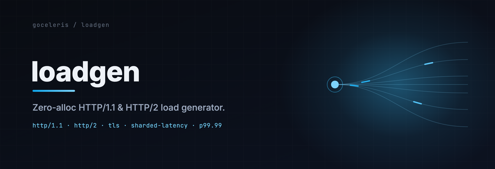

<p align="center">
  
</p>

<p align="center">
  <a href="https://github.com/goceleris/loadgen/actions/workflows/ci.yml?query=branch%3Amain"></a>
  <a href="https://codecov.io/gh/goceleris/loadgen"></a>
  <a href="https://codspeed.io/goceleris/loadgen"></a>
  <a href="https://pkg.go.dev/github.com/goceleris/loadgen"></a>
  <a href="https://github.com/goceleris/loadgen/releases/latest"></a>
  <a href="go.mod"></a>
  <a href="LICENSE"></a>
</p>

<p align="center">
  <strong>A measurement-grade HTTP/1.1 and HTTP/2 load generator for benchmarking web servers.</strong><br>
  It ships its own protocol clients instead of <code>net/http</code>, so the numbers describe the server, not the client.
</p>

<p align="center">
  <a href="#quick-start">Quick start</a> ·
  <a href="#cli-reference">CLI reference</a> ·
  <a href="https://pkg.go.dev/github.com/goceleris/loadgen">API reference</a> ·
  <a href="https://goceleris.dev/benchmarks/">Benchmarks it measures</a>
</p>

## Why loadgen

- **Its own H1 and H2 clients.** No `net/http` on the request path: request bytes are pre-formatted,
  HPACK headers are pre-encoded, and H2 status codes are read from the header block without decoding
  it.
- **Near-zero allocations.** In a local run of v1.4.13 against a server in another process, the
  loadgen process made 7,771 heap allocations in total over 792,576 HTTP/1.1 requests and 9,702 over
  966,623 HTTP/2 requests, about 0.01 per request. A run a quarter as long made nearly as many, so
  they are per-run setup, not per-request cost.
- **HTTP/1.1, HTTP/2 and more.** Prior-knowledge h2c or h2 over TLS (ALPN), the RFC 7540 §3.2 h2c
  upgrade, a weighted per-worker mix of all three, and built-in WebSocket and Server-Sent Events
  drivers.
- **Full latency distributions.** Every worker records into its own HdrHistogram (up to 30 s at three
  significant digits); p50 to p99.99 come from the merged histogram, and the full distribution is
  exported with every result for re-aggregation.
- **Coordinated-omission correction.** In rated mode (`-rate`), latency is measured from each
  request's *intended* send time, so a server stall shows up as tail latency instead of disappearing.
- **It tells you when it was the bottleneck.** A process-CPU sampler and a Linux receive-queue probe
  flag runs where the client, not the server, limited the result.

loadgen measures one server with minimal client overhead. It is not a general-purpose load-testing
framework; for scripted user journeys, use a tool built for that, such as k6.

## Quick start

Install the CLI (Go 1.27 or newer, per [`go.mod`](go.mod)):

```bash
go install github.com/goceleris/loadgen/cmd/loadgen@latest
```

Run 10 seconds of HTTP/1.1 load with 64 connections against a server on port 8080:

```bash
loadgen -url http://localhost:8080/ -duration 10s -connections 64
```

Progress goes to stderr and the result goes to stdout as one JSON object: request and error counts,
requests per second, latency percentiles in nanoseconds, a per-second timeseries and the full
histogram. To pull out the headline numbers:

```bash
loadgen -url http://localhost:8080/ -duration 10s -connections 64 \
  | jq '{rps: .requests_per_sec, p50_ms: (.latency.p50 / 1e6), p99_ms: (.latency.p99 / 1e6), errors}'
```

Add `-h2` for HTTP/2, `-rate 20000` for a coordinated-omission-corrected run at 20k req/s, or
`-mode ws-echo` for WebSocket round trips. Pre-built binaries for Linux and macOS are attached to every
[release](https://github.com/goceleris/loadgen/releases/latest); see
[Pre-built binary releases](#pre-built-binary-releases).

### As a library

```bash
go get github.com/goceleris/loadgen
```

```go
package main

import (
	"context"
	"fmt"
	"time"

	"github.com/goceleris/loadgen"
)

func main() {
	b, err := loadgen.New(loadgen.Config{
		URL:         "http://localhost:8080/",
		Duration:    15 * time.Second,
		Connections: 256,
		Workers:     256,
	})
	if err != nil {
		panic(err)
	}
	result, err := b.Run(context.Background())
	if err != nil {
		panic(err)
	}
	fmt.Printf("%.0f req/s, p99=%v\n", result.RequestsPerSec, result.Latency.P99)
}
```

More library examples:

<details>
<summary>HTTP/2, HTTPS, rated mode and progress callbacks</summary>

```go
// HTTP/2 prior knowledge: the workers share 16 connections, up to 100 streams each.
cfg := loadgen.Config{
	URL:      "http://localhost:8080/",
	Duration: 15 * time.Second,
	HTTP2:    true,
	HTTP2Options: loadgen.HTTP2Options{
		Connections: 16,
		MaxStreams:  100,
	},
	Workers: 64,
}
```

```go
// HTTPS against a self-signed certificate. For client certificates, a custom CA pool
// or a pinned cipher list, set Config.TLSConfig to a *tls.Config instead.
cfg := loadgen.Config{
	URL:                "https://api.example.com/health",
	Duration:           30 * time.Second,
	Connections:        128,
	Workers:            128,
	InsecureSkipVerify: true, // self-signed certs only
}
```

```go
// Constant-rate (rated) run: 10k req/s, coordinated-omission corrected.
cfg := loadgen.Config{
	URL:         "http://localhost:8080/",
	Duration:    30 * time.Second,
	Connections: 64,
	Workers:     64,
	Rate:        10000,
}
```

```go
// Progress monitoring.
cfg := loadgen.Config{
	// ...
	OnProgress: func(elapsed time.Duration, snapshot loadgen.Result) {
		fmt.Printf("\r%s: %d req, %.0f req/s",
			elapsed.Round(time.Second), snapshot.Requests, snapshot.RequestsPerSec)
	},
}
```

</details>

## How the goceleris projects use it

- **[probatorium](https://github.com/goceleris/probatorium)**, the benchmark and validation harness,
  imports loadgen as a library. Its bench runner drives every cell with `loadgen.New(...).Run`, runs the
  rated latency-at-SLO sweep through `Config.Rate`, and merges the exported histograms across runs
  before publishing.
- **[celeris](https://github.com/goceleris/celeris)**: the numbers on the
  [goceleris.dev benchmark dashboard](https://goceleris.dev/benchmarks/) are those probatorium runs, so
  every published celeris figure was measured by loadgen. In the other direction, loadgen's own
  integration test drives a live celeris server over H1, H2, h2c upgrade and mixed traffic
  (`internal/integrationtest/testserver`).

## Load modes

loadgen selects one driver per run. HTTP protocol selection (`-h2` / `-h2c-upgrade` / `-mix`) and the
streaming drivers (`-mode`) are mutually exclusive: a run is one or the other.

### HTTP protocols

| Mode | Flag | What it measures |
| --- | --- | --- |
| **HTTP/1.1** (default) | *(none)* | Baseline request/response throughput. One persistent TCP connection per worker, pre-formatted request bytes written with a single write call. For `Connection: close` workloads (`-close`), each worker round-robins a pool of `PoolSize` (16) connections and redials a closed one in line. |
| **HTTP/2** | `-h2` | Multiplexed throughput. Prior-knowledge h2c, or h2 over TLS (ALPN offers `h2`): workers share connections and dispatch streams lock-free, with pre-encoded HPACK headers and batched `WINDOW_UPDATE`. |
| **h2c upgrade** | `-h2c-upgrade` | The RFC 7540 §3.2 cleartext upgrade path. Each connection starts as HTTP/1.1 carrying `Connection: Upgrade, HTTP2-Settings` + `Upgrade: h2c`, reads `101 Switching Protocols`, then switches to HTTP/2 on the same socket. Exercises the handshake that `-h2` skips. Cleartext only: TLS servers negotiate H2 via ALPN. |
| **Protocol mix** | `-mix h1:h2:upgrade=N:N:N` | A traffic blend. Each worker is assigned a protocol by a weighted draw (seeded from the weights, so repeated runs assign the same way) and keeps it for the whole run. |

### Streaming drivers

Set `-mode` (or `Config.Mode`) to drive a non-HTTP protocol. One long-lived connection is held open per
worker; each unit of work flows through the same worker, latency and timeseries pipeline as an HTTP
request.

| Mode | What it measures |
| --- | --- |
| `ws-echo` | RFC 6455 WebSocket echo round-trip latency (small text frame). |
| `ws-large-echo` | Echo round trip with a 64 KiB payload; exercises framing and buffering under large frames. |
| `ws-hub` | Broadcast fan-out: the worker only reads, and each unit is the wait for the server's next broadcast frame (frames carry no timestamp, so this is inter-frame time). No outbound write per unit. |
| `sse-fanout` | Server-Sent Events delivery. One `GET` stream per worker; each unit blocks until the next event arrives, so inter-event delivery time *is* the recorded latency. |

## Rated mode (coordinated-omission correction)

By default every worker sends its next request as soon as the previous response arrives (a closed
loop), and loadgen reports throughput at saturation.

Pass `-rate <req/s>` (or set `Config.Rate`) to switch to a constant-rate schedule: one intended send
time every `1/rate` seconds, issued whether or not earlier requests have completed, and served by the
worker pool. Latency is measured from the request's *intended* dispatch time, not the moment
it actually left: Gil Tene's coordinated-omission correction. When the server stalls, the backlog of
intended-but-unsent requests accumulates and surfaces as honest tail latency, instead of being hidden by
a client that simply slowed down to match. Rated runs set `rated_mode: true`, `target_rps` and
`mode: "rated"` in the result.

`-rate` (constant rate, coordinated-omission corrected) and `-max-rps` are independent rate controls.
`-max-rps` only paces each closed-loop worker to at most `max(1, max-rps / workers)` req/s, so latency
is still measured from the actual send and it does not apply in rated mode. `-rate` is the right one for
latency-SLO measurement.

## Federation

When one host can't generate enough load to saturate the target, run loadgen on two boxes and merge their
measurements client-side.

- Start a **sidecar** on the second host: `loadgen -sidecar :9099`. It binds, waits for one
  coordinator, and takes the run's settings from the coordinator's start frame: URL, duration, rate,
  connection and worker counts, and the HTTP/2 switch. Other settings (method, headers, body, `-close`,
  `-mode`, `-mix`, `-h2c-upgrade`, `-insecure`, `-max-rps`, warmup) are not forwarded, and the
  sidecar runs without a warmup.
- Start the **coordinator** with `-peer <sidecar-host>:9099` plus the usual flags. It dials the sidecar,
  both sides start against the target at an agreed time (so their clocks must agree), and at the end of
  the run the coordinator pulls the sidecar's V2-compressed HdrHistogram and merges it into its own. The
  latency percentiles come from the merged histogram; request and error counts stay local, with the
  sidecar's reported as `federation.peer_requests` and `federation.peer_errors`.

The wire protocol is deliberately minimal: a `loadgen-fed-v1` magic handshake followed by
length-prefixed JSON frames (`start` / `ack` / `result` / `err`) over one TCP connection, with no
retries. It is best-effort: if any step fails, the coordinator records
`federation.merge_succeeded = false` (with `federation.merge_error`) and reports its local-only
histogram. Merge outcomes appear in the
`federation` block of the result.

## HdrHistogram export

Every result carries the full latency distribution, not just the summary percentiles:

- `Result.Histogram` is a V2-compressed HdrHistogram (base64 in JSON) of nanosecond latencies, up to
  30 s at three significant digits. It is empty when no samples were recorded.
- `loadgen.DecodeHistogram([]byte)` and the recorder's `EncodeHistogram()` are exported so downstream
  tools (the probatorium aggregator) can decode, re-merge across cells and recompute percentiles without
  re-running the benchmark.

This is the same encoding federation uses on the wire, so a merged multi-host distribution round-trips
losslessly.

## Self-instrumentation

Two probes flag the runs where loadgen, not the server, was the limiting factor:

- **CPU sampler** (`-cpu-monitor`, on by default, Linux only). Samples the loadgen process's own CPU at
  1 Hz and reports the P95 as `cpu_pct_p95` (percentage of available cores). A high value means loadgen was
  compute-bound and the throughput number is a client ceiling, not a server ceiling.
- **Receive-queue probe** (`-recvq-probe`, on by default, Linux only). Reads per-socket receive-queue
  depths from `/proc/net/tcp` and `/proc/net/tcp6` every 5 s. If the median across loadgen's sockets
  stays above 64 KB for 10 s or more it latches `recvq_high: true`: the client couldn't drain responses fast enough, so the observed tail
  latency is loadgen-side. A no-op on other platforms.

## CLI reference

```text
loadgen [flags] -url <target>
```

### Flags

| Flag | Default | Meaning |
| --- | --- | --- |
| `-url string` | *(required)* | Target URL, with an `http` or `https` scheme. |
| `-duration duration` | `15s` | Measured benchmark duration (excludes warmup). |
| `-warmup duration` | `2s` | Warmup phase before measurement. `0` to skip. |
| `-connections int` | `256` | Default worker count for H1; each H1 worker holds one connection (or a `PoolSize` pool with `-close`). |
| `-workers int` | `0` | Concurrent workers. `0` → `-connections` for H1, `NumCPU*4` for multiplexed modes. Multiplexed modes (`-h2`, `-h2c-upgrade`, `-mix`) then run 4 workers per configured worker. |
| `-method string` | `GET` | HTTP method. |
| `-H "Key: Value"` | | Custom header, repeatable. |
| `-body-file string` | | Read the request body from a file. |
| `-close` | `false` | Send `Connection: close` (H1 only). |
| `-h2` | `false` | HTTP/2 prior knowledge (h2c), or h2 over TLS. |
| `-h2c-upgrade` | `false` | HTTP/2 via the RFC 7540 §3.2 h2c upgrade handshake. |
| `-mix string` | | Per-worker protocol mix, e.g. `h1:h2:upgrade=4:4:1`. |
| `-h2-conns int` | `16` | H2 connections. |
| `-h2-streams int` | `100` | Max concurrent H2 streams per connection. |
| `-mode string` | | Streaming driver: `ws-echo` \| `ws-large-echo` \| `ws-hub` \| `sse-fanout`. Mutually exclusive with `-h2` / `-h2c-upgrade` / `-mix`. |
| `-insecure` | `false` | Skip TLS certificate verification. |
| `-max-rps int` | `0` | Cap on total req/s, applied by pacing each worker to `max(1, max-rps / workers)` (`0` = unlimited; ignored in rated mode). |
| `-rate float` | `0` | Constant request rate (req/s). `>0` enables rated mode with coordinated-omission correction. |
| `-peer host:port` | | Federation coordinator: dial a sidecar and merge its histogram. |
| `-sidecar host:port` | | Run as a federation sidecar; all workload settings come from the coordinator. |
| `-out string` | | Also write the JSON result to this file (in addition to stdout). |
| `-cpu-monitor` | `true` | Enable the 1 Hz process-CPU sampler (`cpu_pct_p95`). |
| `-recvq-probe` | `true` | Enable the per-socket receive-queue probe (Linux only; `recvq_high`). |

> The CLI's `-warmup` default is `2s`; the library's `DefaultConfig()` uses `5s`.

### Examples

```bash
# H1 with custom headers.
loadgen -url http://localhost:8080/api -duration 30s -connections 512 \
  -H "Authorization: Bearer token" -H "Content-Type: application/json"

# H2 prior knowledge.
loadgen -url http://localhost:8080/ -h2 -h2-conns 16 -h2-streams 200 -duration 30s

# Rated latency measurement at 20k req/s.
loadgen -url http://localhost:8080/ -rate 20000 -duration 60s

# WebSocket echo latency.
loadgen -url http://localhost:8080/ws -mode ws-echo -duration 30s

# HTTPS with a request-rate cap and a result file.
loadgen -url https://api.example.com/health -insecure -max-rps 5000 -duration 60s -out result.json
```

### `-h2c-upgrade` (RFC 7540 §3.2)

Starts each connection as HTTP/1.1 carrying `Connection: Upgrade, HTTP2-Settings` + `Upgrade: h2c`,
reads a `101 Switching Protocols` response, then switches to HTTP/2 on the same TCP socket. This
exercises the cleartext upgrade path that `-h2` skips (prior knowledge sends the H2 preface directly).
Mutually exclusive with `-h2` and `-mix`. Only defined over cleartext HTTP: TLS servers negotiate H2 via
ALPN.

```bash
# Basic h2c upgrade run.
loadgen -url http://localhost:8080/ -h2c-upgrade -duration 30s

# h2c upgrade with browser-style fan-out.
loadgen -url http://localhost:8080/ -h2c-upgrade -h2-conns 16 -h2-streams 200 -duration 30s
```

The result includes an `upgrade` block (also present for a `-mix` with a non-zero upgrade weight), and
stderr prints `h2c upgrade: X/Y conns upgraded successfully`.

### `-mix`: traffic mixtures

Assigns each worker to a protocol by a weighted draw across H1, H2 prior knowledge and h2c upgrade,
seeded from the weights so the assignment repeats run to run. Workers keep their protocol for the whole
run; the H2 and upgrade sub-clients each open `-h2-conns` connections. Mutually exclusive with `-h2` and
`-h2c-upgrade`. Format: `h1:h2:upgrade=N:N:N` (the `h1:h2:upgrade=` prefix is optional; a bare `N:N:N`
also parses). Weights are non-negative integers; `0:0:0` is rejected.

```bash
# Equal fan-out across all three protocols.
loadgen -url http://localhost:8080/ -mix h1:h2:upgrade=1:1:1 -duration 30s

# Browser-heavy H2 with a trickle of legacy upgrades.
loadgen -url http://localhost:8080/ -mix h1:h2:upgrade=4:4:1 -duration 60s
```

The `mix` block in the result reports per-protocol connection, request and error counts; stderr prints a
matching breakdown.

## Cluster-bench integration contract

`cmd/loadgen` is built to be invoked remotely (over SSH or by an orchestrator such as Ansible) on a
dedicated load-generation host. The contract:

| Aspect | Behavior |
| --- | --- |
| **stdout** | A single pretty-printed JSON `Result` object: no progress noise, no log lines. |
| **stderr** | Human-readable progress (`<elapsed>  <reqs>  <rps>`), warmup and mix/upgrade summaries, error traces. |
| **exit 0** | The benchmark ran (request errors are reported inside the JSON, not via the exit code). |
| **exit 2** | Conflicting `-h2` / `-h2c-upgrade` / `-mix`, or an unparseable `-mix`. No JSON. |
| **exit 1** | Any other configuration error (`-url` missing, a bad `-H`, an unreadable body file, an invalid config), or a run that could not start or failed outright, such as a target that refused every dial. No JSON. |
| **SIGINT / SIGTERM** | During the run, cancels it *gracefully*: the partial `Result` is still printed to stdout, exit 0. |

### JSON output schema

The shape is `loadgen.Result` in [`results.go`](results.go). Fields marked *(optional)* are omitted when
empty (`omitempty`).

| Field | Type | Meaning |
| --- | --- | --- |
| `requests` | int64 | Successful requests during the measurement window. |
| `errors` | int64 | Errors during the measurement window. |
| `duration` | duration (ns) | Wall-clock measurement duration (post-warmup). |
| `requests_per_sec` | float64 | `requests / duration.Seconds()`. |
| `throughput_bps` | float64 | Response-body bytes per second. Accurate for H1; the H2 client currently counts only the last DATA frame of each response, so multi-frame H2 bodies are undercounted. |
| `latency` | object | `{avg, min, max, p50, p75, p90, p99, p99_9, p99_99}`, each a duration in ns. |
| `loadgen_version` | string | loadgen build that produced the run. *(optional)* |
| `mode` | string | `"saturation"` or `"rated"`. *(optional)* |
| `rated_mode` | bool | True when driven by the constant-rate scheduler. *(optional)* |
| `target_rps` | float64 | Requested rate; meaningful only when `rated_mode`. *(optional)* |
| `histogram` | base64 bytes | V2-compressed HdrHistogram of the full distribution (ns, up to 30 s, 3 significant digits). *(optional)* |
| `client_cpu_percent` | float64 | Whole-host CPU% over the run, from `/proc/stat` (Linux only). *(optional)* |
| `cpu_pct_p95` | float64 | P95 of the 1 Hz process-CPU sampler. *(optional)* |
| `recvq_high` | bool | True when the receive-queue probe latched (loadgen-side backpressure). *(optional)* |
| `dial_retries` | uint64 | TCP SYN retries after an RST (listener-replacement / engine-switch window). *(optional)* |
| `connect_errors` | uint64 | Dial/handshake failures (TCP, TLS, WS/SSE upgrade, H1 reconnect). *(optional)* |
| `timeseries` | array | 1-second snapshots: `{t, rps, p99_ms, errors, connect_errors}`. *(optional)* |
| `warmup` | object | Warmup-phase `{requests, errors, connect_errors}`; a zero-request, nonzero-error warmup means the target was never healthy. *(optional)* |
| `upgrade` | object | h2c-upgrade handshake tally (`-h2c-upgrade`). *(optional)* |
| `mix` | object | Per-protocol connection/request/error counts (`-mix`). *(optional)* |
| `federation` | object | Federated-run outcome (`role`, `peer`, `peer_requests`, `peer_errors`, `merge_succeeded`, `merge_error`). *(optional)* |

### Pre-built binary releases

GitHub Releases ship platform tarballs that orchestrators can fetch directly:

```bash
TAG=v1.4.13
OS=linux
ARCH=amd64
curl -fsSL "https://github.com/goceleris/loadgen/releases/download/${TAG}/loadgen_${OS}_${ARCH}.tar.gz" \
  | tar xz -C /tmp/
chmod +x /tmp/loadgen-${OS}-${ARCH}
/tmp/loadgen-${OS}-${ARCH} -url http://target:8080/ -duration 10s
```

GitHub displays the SHA-256 of each release asset on the release page. `gh release download <tag>` and
the web UI verify checksums automatically, so no separate `.sha256` sidecar ships.

### Verify a release

Every release tarball is built by the [release workflow](.github/workflows/release.yml) and, from the
release after v1.4.13 on, carries a signed [SLSA build provenance](https://slsa.dev/provenance/)
attestation, generated with `actions/attest-build-provenance` and recorded in GitHub's attestation
store. Before running a downloaded binary on a bench host, check that the asset really came from this
repository's release pipeline:

```bash
gh attestation verify loadgen_linux_amd64.tar.gz -R goceleris/loadgen
```

The command fails if the archive was tampered with after the build or was not produced by a
`goceleris/loadgen` workflow. Add `--format json` to inspect the attested source commit, workflow path
and builder. Releases published before the attestation step was added (v1.4.13 and earlier) have no
attestation and will fail verification.

## Architecture

```text
┌──────────────────────────────────────────────────────┐
│                     Benchmarker                      │
│   ┌──────────┐   ┌──────────┐         ┌──────────┐   │
│   │ Worker 0 │   │ Worker 1 │   ...   │ Worker N │   │
│   └────┬─────┘   └────┬─────┘         └────┬─────┘   │
│        │              │                    │         │
│   ┌────▼──────────────▼────────────────────▼─────┐   │
│   │               Client interface               │   │
│   │  ┌──────────┐  ┌──────────┐  ┌────────────┐  │   │
│   │  │ h1Client │  │ h2Client │  │ WS/SSE/mix │  │   │
│   │  └──────────┘  └──────────┘  └────────────┘  │   │
│   └──────────────────────────────────────────────┘   │
│                                                      │
│   ┌──────────────────────────────────────────────┐   │
│   │            ShardedLatencyRecorder            │   │
│   │     [Shard 0]  [Shard 1]  ...  [Shard N]     │   │
│   │   (per-worker HdrHistogram, merged at end)   │   │
│   └──────────────────────────────────────────────┘   │
└──────────────────────────────────────────────────────┘
```

### H1 worker model

Each worker owns a dedicated TCP connection (keep-alive) or a round-robin pool (`Connection: close`,
`PoolSize` = 16). The request bytes are built once and written with a single write call. There is no
synchronization between workers.

### H2 multiplexed model

N workers share M connections. Each connection has a write goroutine (serializes frame writes, allocates
stream IDs) and a read goroutine (dispatches responses to waiting workers via lock-free stream slots).
Workers acquire a stream semaphore, submit a write request, and wait on a pooled response channel.

### Latency recording

Each worker records into its own shard. The cumulative HdrHistogram is single-writer and lock-free; a
separate windowed histogram, used only for the 1-second `p99_ms` timeseries, takes a short per-shard lock
so the ticker goroutine can read and reset it without racing the writer. Request and byte counters are
batched into plain locals and flushed to atomics every 256 requests (H1, WebSocket, SSE) or 16 (the
HTTP/2 modes) to keep ARM64 memory-barrier overhead off the hot path. Shards merge once at completion for percentiles and the
exported histogram.

> **On "zero allocation."** The design goal is an allocation-free request/response cycle: request bytes
> are pre-formatted, HPACK headers are pre-encoded, and H2 status codes are extracted from the encoded
> header block with no allocation. The measurement under [Why loadgen](#why-loadgen) shows the result
> for HTTP/1.1 and HTTP/2 (about 0.01 allocations per request, nearly all of them per-run setup), but it
> is a design target, not an invariant a test enforces. The WebSocket and SSE drivers do allocate per
> message.

## HTTP/2 flow control

The H2 client uses aggressive flow-control settings tuned for benchmark throughput rather than production
fairness.

### Settings

| Parameter | Value | RFC 7540 default | Rationale |
| --- | --- | --- | --- |
| Initial window size | 16 MB | 64 KB | Prevents stalls with large response bodies. |
| Max frame size | 64 KB | 16 KB | Balances framing overhead against flow-control granularity. |
| Header table size | 0 | 4096 | Allocation-free status-code extraction from HPACK headers. |

### Server-preface window

During the handshake the client captures the connection-level `WINDOW_UPDATE(stream 0)` a server sends in
its preface, before its `SETTINGS` ack, and seeds its connection send window with it. Servers such as
Kestrel/ASP.NET grow the connection flow-control window this way (65535 → their configured
`InitialConnectionWindowSize`, e.g. 1 MiB). Before v1.4.13 this update was dropped, stranding the send
window at the RFC 7540 §6.9.2 floor of 65535 and deadlocking sustained request-body sends (fixed in
[#69](https://github.com/goceleris/loadgen/pull/69)).

### `WINDOW_UPDATE` batching

The read loop accumulates consumed bytes in an atomic counter. The write loop flushes a single
`WINDOW_UPDATE` between request batches and on a 1 ms idle ticker, amortizing frame overhead while
preventing flow-control stalls.

### Stream concurrency

A semaphore sized to `min(server MAX_CONCURRENT_STREAMS, configured MaxStreams)` gates in-flight streams;
stream slots are allocated at 2× that size for wrap-around headroom during bursts.

### Tuning guidance

- **CPU-bound:** add connections. More TCP sockets means more kernel parallelism across cores.
- **IO-bound:** add streams. More multiplexed requests per connection saturates bandwidth.
- **Large responses:** the client refills the connection window continuously but never sends a
  stream-level `WINDOW_UPDATE`, so a single response body larger than the 16 MB initial window stalls
  its stream.

## Configuration reference

Beyond the flags above, the library `Config` exposes knobs the CLI leaves at their defaults:

| Field | Default | Notes |
| --- | --- | --- |
| `DialTimeout` | `10s` | TCP connect / reconnect timeout. |
| `ReadBufferSize` / `WriteBufferSize` | 256 KB (H1), 2 MB (H2) | Kernel socket buffer sizes (`SO_RCVBUF` / `SO_SNDBUF`) for the H1 and H2 clients. |
| `PoolSize` | `16` | Connections per worker in `Connection: close` mode. |
| `MaxResponseSize` | 10 MB | Cap on response-body bytes read by the H1 client (a larger response is an error); `-1` for unlimited. |
| `TLSConfig` | | Client certs, custom CA pool, or cipher suites for the H1 and H2 clients over HTTPS (the WebSocket and SSE drivers do not use it). |

See the [package reference](https://pkg.go.dev/github.com/goceleris/loadgen) for the full `Config` and
`Result` types.

## Extending with a custom client

For protocols loadgen does not ship (gRPC, QUIC, …), implement the exported `Client` interface and inject
it via `Config.Client`. When set, the built-in H1/H2 client creation is skipped and your client drives
every worker.

```go
type Client interface {
	DoRequest(ctx context.Context, workerID int) (bytesRead int, err error)
	Close()
}

cfg := loadgen.Config{
	URL:         "http://localhost:50051/", // still required: Validate() enforces an http/https URL
	Duration:    15 * time.Second,
	Connections: 64, // required: New() rejects Connections < 1
	Workers:     64,
	Client:      &myGRPCClient{}, // implements loadgen.Client
}
```

Even with a custom `Client`, `Config.URL` must be a valid `http`/`https` URL: `Config.Validate()` enforces
it before your client runs, and your client is free to reinterpret the target however it needs.
WebSocket and SSE are built in; reach for `-mode` / `Config.Mode` rather than a custom client for those.

## Related projects

| Project | What it is |
| --- | --- |
| [celeris](https://github.com/goceleris/celeris) | The HTTP engine for Go whose published benchmarks loadgen measures |
| [probatorium](https://github.com/goceleris/probatorium) | The benchmark and validation harness that drives loadgen on the bench cluster |
| [docs](https://github.com/goceleris/docs) | The source of [goceleris.dev](https://goceleris.dev): documentation and the benchmark dashboard |

## Contributing

See [CONTRIBUTING.md](CONTRIBUTING.md) for the build, test and pull-request flow, and
[SECURITY.md](SECURITY.md) to report a vulnerability. The root package's Go benchmarks run on
[CodSpeed](https://codspeed.io/goceleris/loadgen) on every push to `main` and on pull requests that
change the root package's Go files, `go.mod` or `go.sum`.

## License

Apache License 2.0; see [LICENSE](LICENSE).
